# 📡 Keenetic Aria2 Manager

<div align="center">


**Keenetic router'lar için tam özellikli aria2 indirme yöneticisi**

*Kurulum · Yönetim · Telegram Bildirimleri · Yedekleme · Web Arayüzü*


</div>

---

## 📋 İçindekiler

- [Özellikler](#-özellikler)
- [Gereksinimler](#-gereksinimler)
- [Kurulum](#-kurulum)
- [Ekran Görüntüleri](#-ekran-görüntüleri)
- [Menü Yapısı](#-menü-yapısı)
- [Telegram Bildirimleri](#-telegram-bildirimleri)
- [Yedekleme Sistemi](#-yedekleme-sistemi)
- [SSS](#-sss)
- [Lisans](#-lisans)

---

## ✨ Özellikler

| Özellik | Açıklama |
|---|---|
| 🚀 **Çok bağlantılı indirme** | Split/segment desteğiyle paralel indirme |
| 🌐 **AriaNg Web Arayüzü** | Dahili web sunucusu — kurulum gerektirmez |
| 📱 **Telegram Bildirimleri** | Her indirme olayı için anlık bildirim |
| 💾 **Yedek & Geri Yükleme** | Temel ve tam yedek, tek tıkla geri yükleme |
| 🔧 **51 Config Ayarı** | 8 kategoride tüm aria2 ayarları |
| 🖥️ **Sistem Sağlığı** | CPU, RAM, disk ve ağ izleme |
| 🔍 **Tanı & Test** | Otomatik sorun tespiti ve düzeltme |
| 🌍 **Çift Dil** | Türkçe / İngilizce tam destek |
| 📦 **USB Desteği** | Otomatik USB disk algılama |

---

## 📦 Gereksinimler

> [!IMPORTANT]
> **Bu betik yalnızca USB'ye kurulu Entware ile çalışır.**
> Tüm dosyalar `/opt` dizinine yazılır. Entware'in USB diskte kurulu olması **zorunludur**.
> `/opt` dizini yoksa veya Entware kurulu değilse betik çalışmaz.

- ✅ Keenetic OS
- ✅ **Entware — USB diske kurulu olmalı**
- ✅ `opkg` paket yöneticisi
- ✅ `curl` *(Telegram bildirimleri için — otomatik kurulur)*

---

## ⚡ Kurulum

### Hızlı Kurulum

```bash
opkg update && opkg install curl && \
mkdir -p /opt/lib/opkg && \
curl -fsSL https://raw.githubusercontent.com/SoulsTurk/keenetic-aria2-manager/main/keenetic-aria2-manager.sh \
  -o /opt/lib/opkg/keenetic-aria2-manager.sh && \
chmod +x /opt/lib/opkg/keenetic-aria2-manager.sh && \
sh /opt/lib/opkg/keenetic-aria2-manager.sh
```

İlk çalıştırmada script otomatik olarak:
- 24 haneli RPC Secret Key oluşturur
- USB disk varsa indirme dizinini yapılandırır
- Kısayolları oluşturur: `aria2m` · `a2m` · `k2m` · `kam` · `aria2manager`

---

## 📸 Ekran Görüntüleri

### Ana Menü
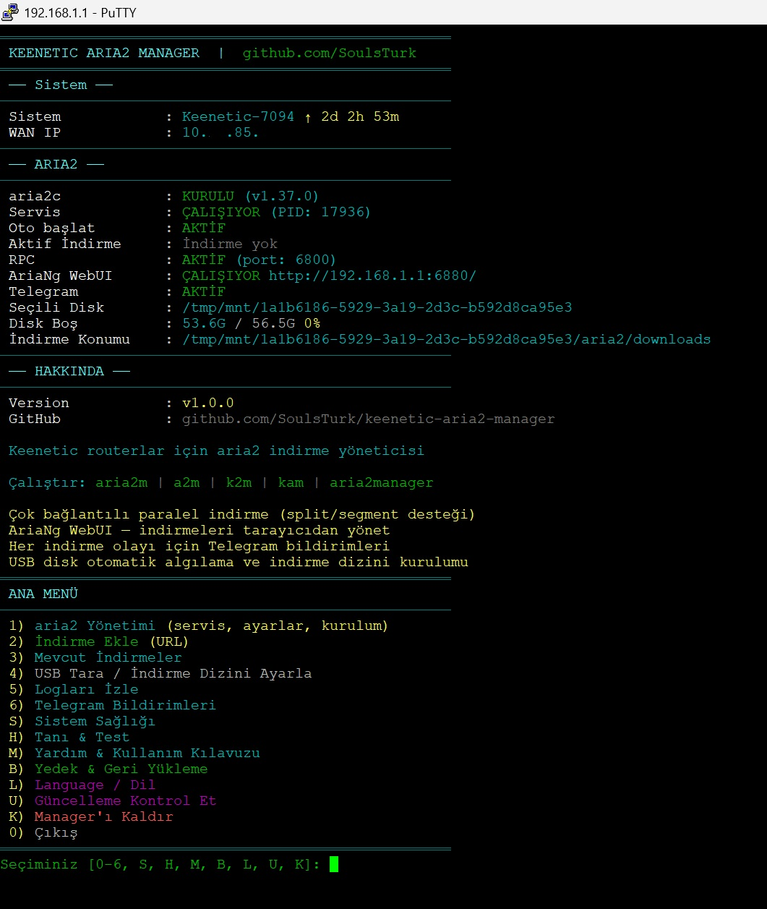

> Sistem durumu, aria2 bilgileri, AriaNg adresi ve tüm özellikler tek ekranda.

---

### Menü 1 — aria2 Yönetimi
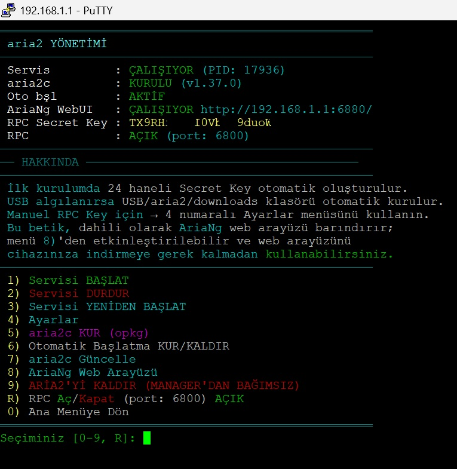

> Servis başlatma/durdurma, kurulum, güncelleme, AriaNg Web Arayüzü ve RPC yönetimi.

---

### Ayarlar Menüsü (Menü 4)
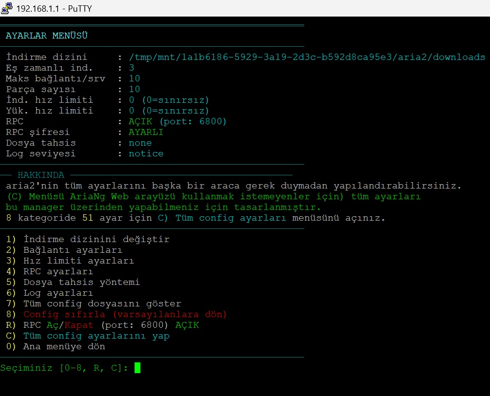

> İndirme dizini, bağlantı, hız, RPC, log ayarları ve **C) Tam Config Sihirbazı** ile 51 ayar.

---

### AriaNg Web Arayüzü
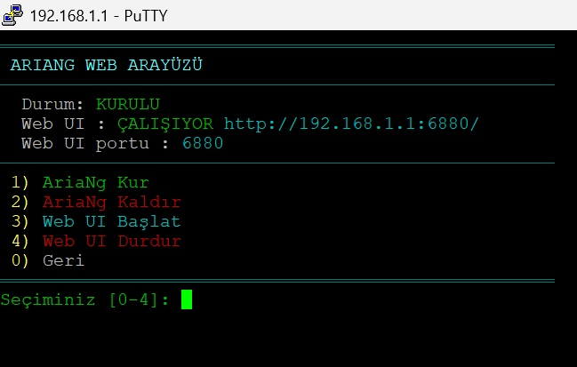

> Dahili AriaNg web arayüzü — tarayıcınızdan `http://192.168.1.1:6880` adresine gidin.

---

### Telegram Bildirimleri
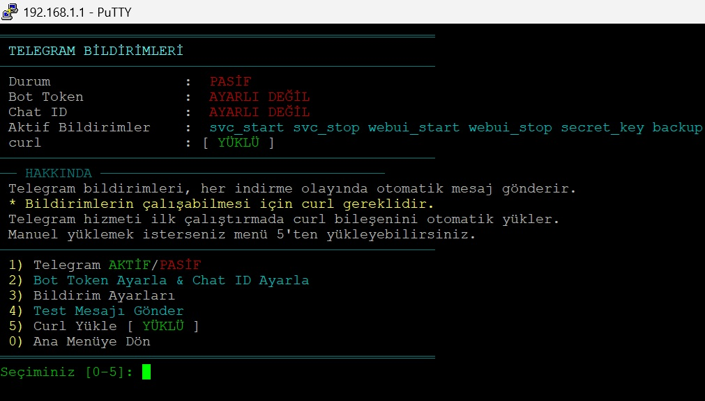

> Bot Token ve Chat ID ayarları, curl kurulumu ve bildirim yönetimi.

---

### Bildirim Ayarları
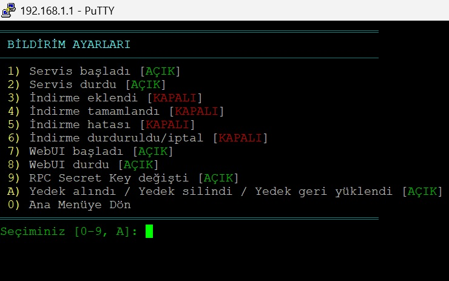

> Hangi olaylar için bildirim alacağınızı seçin — servis, indirme, WebUI, yedek ve daha fazlası.

---

### Yedek & Geri Yükleme
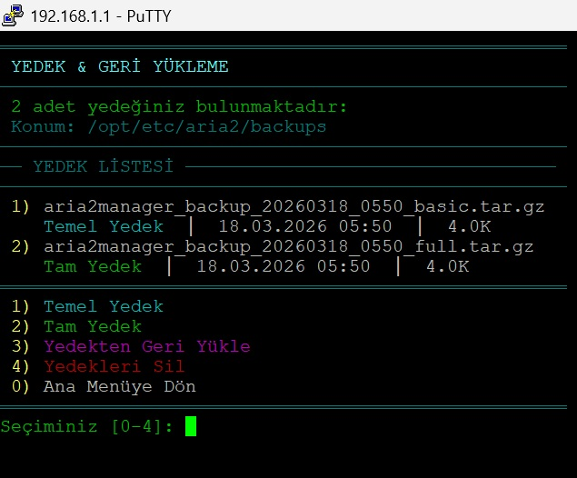

> Temel ve tam yedek alma, yedek listeleme, geri yükleme ve silme.

---

### Sistem Sağlığı
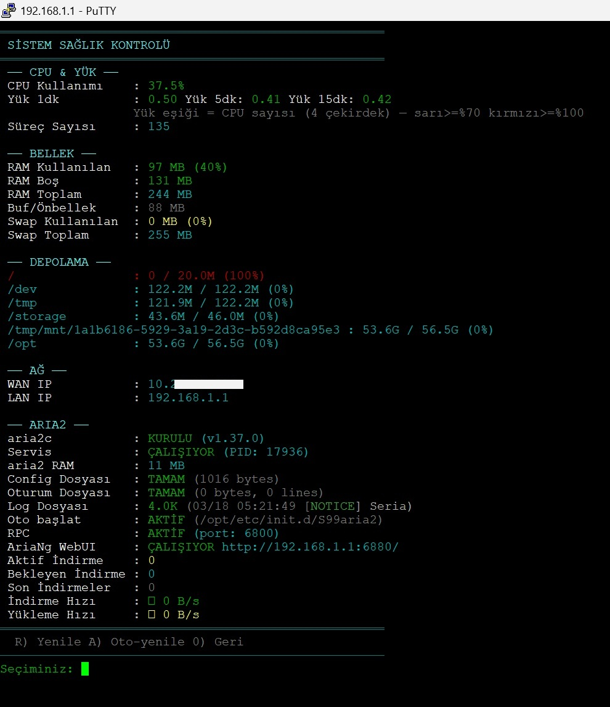

> CPU, RAM, depolama, ağ, aria2 durumu ve indirme hızı gerçek zamanlı izleme.

---

### Tanı & Test
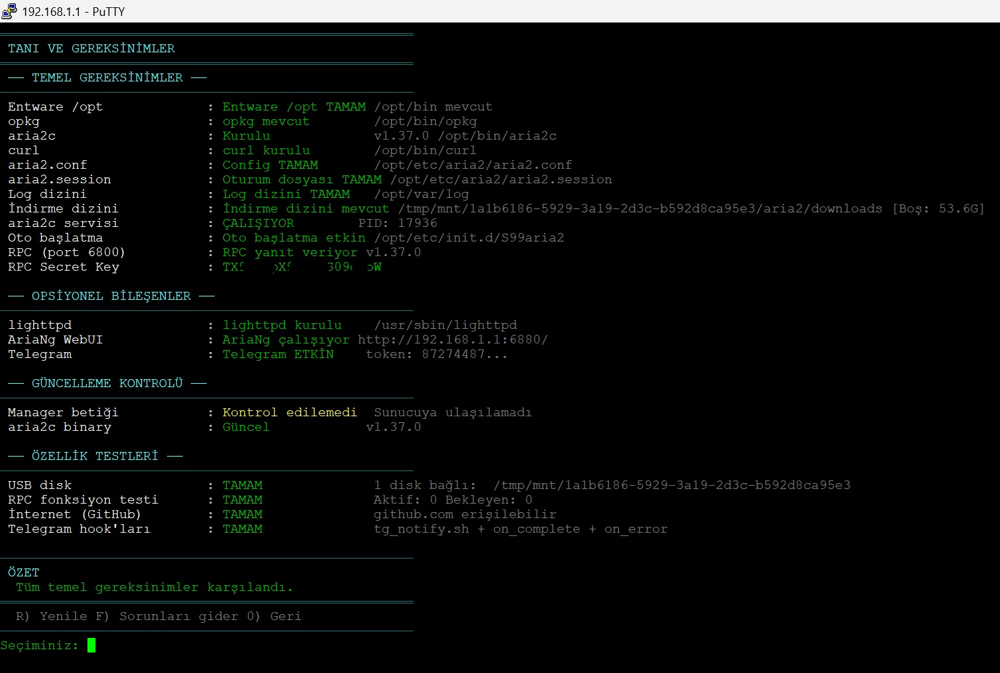

> Gereksinimler, opsiyonel bileşenler, güncelleme kontrolü ve özellik testleri.

---

### aria2 Güncelleme
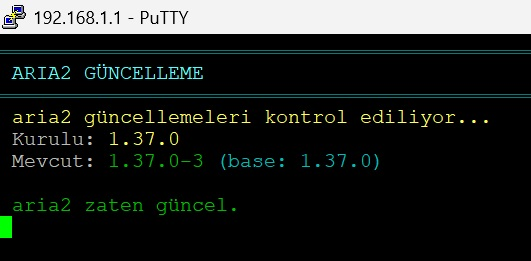

> aria2c binary'sini opkg üzerinden güvenli şekilde güncelleme.

---

### Tam Kaldırma
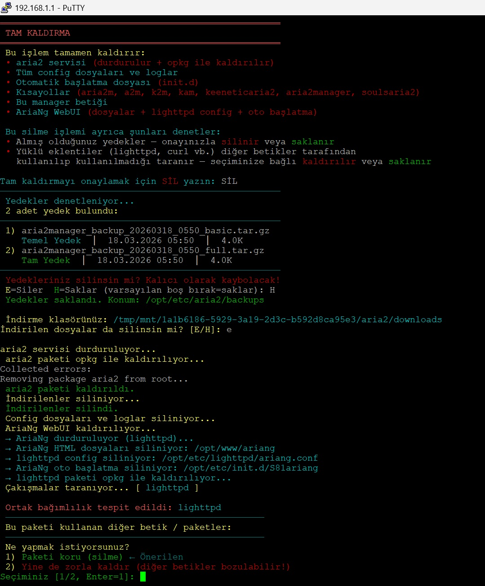

> Yedekleri saklayıp saklamayacağınızı seçerek güvenli kaldırma.

---

### Dil Seçimi
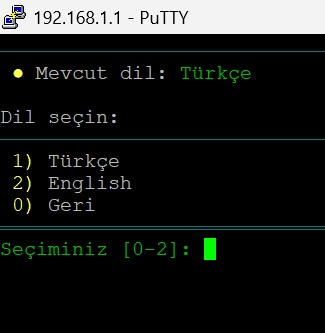

> Türkçe / İngilizce anında dil değişimi.

---

### Yardım & SSS
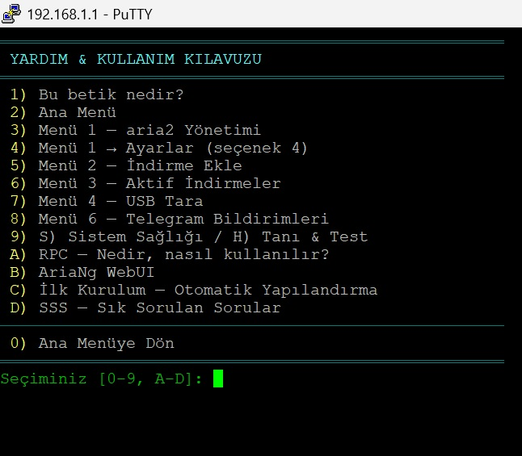

> Sık sorulan sorular, menü açıklamaları ve kullanım kılavuzu.

---

## 🗂️ Menü Yapısı

```
Ana Menü
├── 1) aria2 Yönetimi
│   ├── Servisi Başlat / Durdur / Yeniden Başlat
│   ├── 4) Ayarlar
│   │   ├── İndirme dizini
│   │   ├── Bağlantı ayarları
│   │   ├── Hız limitleri
│   │   ├── RPC ayarları
│   │   ├── Dosya tahsis yöntemi
│   │   ├── Log ayarları
│   │   └── C) Tam Config Sihirbazı (51 ayar, 8 kategori)
│   ├── 5) aria2c KUR (opkg)
│   ├── 6) Otomatik Başlatma KUR/KALDIR
│   ├── 7) aria2c Güncelle
│   └── 8) AriaNg Web Arayüzü
├── 2) İndirme Ekle (URL)
├── 3) Mevcut İndirmeler
├── 4) USB Tara / İndirme Dizini Ayarla
├── 5) Logları İzle
├── 6) Telegram Bildirimleri
│   ├── AKTİF/PASİF toggle
│   ├── Bot Token & Chat ID
│   ├── Bildirim Ayarları (10 olay türü)
│   ├── Test Mesajı Gönder
│   └── Curl Yükle
├── S) Sistem Sağlığı
├── H) Tanı & Test
├── M) Yardım & Kullanım Kılavuzu
├── B) Yedek & Geri Yükleme
│   ├── 1) Temel Yedek
│   ├── 2) Tam Yedek
│   ├── 3) Yedekten Geri Yükle
│   └── 4) Yedekleri Sil
├── L) Language / Dil
├── U) Güncelleme Kontrol Et
└── K) Manager'ı Kaldır
```

---

## 📱 Telegram Bildirimleri

Aşağıdaki olaylar için anlık Telegram bildirimi alabilirsiniz:

| Bildirim | Emoji | Varsayılan |
|---|---|---|
| aria2 servisi başladı | ✅ | AÇIK |
| aria2 servisi durdu | ⏹ | AÇIK |
| İndirme eklendi | ➕ | KAPALI |
| İndirme tamamlandı | ✅ | KAPALI |
| İndirme hatası | ❌ | KAPALI |
| İndirme durduruldu | ⏸ | KAPALI |
| WebUI başladı | 🖥️ | AÇIK |
| WebUI durdu | ⏹ | AÇIK |
| RPC Secret Key değişti | 🔑 | AÇIK |
| Yedek alındı/silindi/geri yüklendi | 💾🗑♻️ | AÇIK |

**Kurulum:**
1. [BotFather](https://t.me/botfather) üzerinden bir bot oluşturun
2. Bot Token'ınızı kopyalayın
3. Chat ID'nizi öğrenmek için [@userinfobot](https://t.me/userinfobot)'u kullanın
4. Menü 6 → 2) Bot Token & Chat ID Ayarla

---

## 💾 Yedekleme Sistemi

### Temel Yedek
`aria2.conf`, `telegram.conf`, dil tercihi

### Tam Yedek
Temel yedek + session dosyası, init script, tüm Telegram hook scriptleri, AriaNg port ayarı

### Yedek Formatı
```
aria2manager_backup_YYYYAAGG_SSDD_basic.tar.gz
aria2manager_backup_YYYYAAGG_SSDD_full.tar.gz
```

Yedekler `/opt/etc/aria2/backups/` konumuna kaydedilir.

> **Not:** Manager kaldırılırken yedekler silinmez — size sorulur.

---

## ❓ SSS

**S: aria2c kurmadan config yapabilir miyim?**  
C: Evet, Menü 1 → Ayarlar → C) Config Sihirbazı aria2c kurulmadan da çalışır. Kurulum sonrası ayarlarınız korunur.

**S: AriaNg WebUI için ayrı bir şey indirmem gerekiyor mu?**  
C: Hayır. Manager dahili olarak AriaNg barındırır. Menü 1 → 8) AriaNg Web Arayüzü → Kur ve Başlat yeterlidir.

**S: Telegram bildirimleri için curl gerekli mi?**  
C: Evet. Manager, Telegram etkinleştirildiğinde curl'ü otomatik kurar. Manuel kurulum için Menü 6 → 5) Curl Yükle.

**S: Script'i güncellemek için ne yapmalıyım?**  
C: Ana Menü → U) Güncelleme Kontrol Et → Güncelle seçeneğini kullanın.

**S: Tüm ayarları sıfırlamak istiyorum.**  
C: Menü 1 → Ayarlar → 8) Config sıfırla. Ya da B) Yedekten geri yükle.

---

## 🧑‍💻 Katkı

Pull request ve issue'lar memnuniyetle karşılanır.

```
github.com/SoulsTurk/keenetic-aria2-manager
```

---

## 📄 Lisans

GPL-3.0 License — kullanabilir ve dağıtabilirsiniz, ancak değiştirdiğinizde aynı lisansla açık kaynak olarak paylaşmanız gerekir.

---

<div align="center">

**Keenetic Aria2 Manager** · v1.0.0 · by [SoulsTurk](https://github.com/SoulsTurk)

</div>
