<div align="right">

[](README.md)
[](README_EN.md)
[](README_RU.md)

</div>

# 📡 Keenetic Aria2 Manager

<div align="center">


**Полнофункциональный менеджер загрузок aria2 для роутеров Keenetic**

*Установка · Управление · Уведомления Telegram · Резервные копии · Веб-интерфейс*


</div>

---

## 📋 Содержание

- [Возможности](#-возможности)
- [Требования](#-требования)
- [Установка](#-установка)
- [Скриншоты](#-скриншоты)
- [Структура меню](#-структура-меню)
- [Уведомления Telegram](#-уведомления-telegram)
- [Система резервного копирования](#-система-резервного-копирования)
- [Часто задаваемые вопросы](#-часто-задаваемые-вопросы)
- [Лицензия](#-лицензия)

---

## ✨ Возможности

| Возможность | Описание |
|---|---|
| 🚀 **Многопоточная загрузка** | Параллельная загрузка с поддержкой разделения на сегменты |
| 🌐 **Веб-интерфейс AriaNg** | Встроенный веб-сервер — не требует отдельной установки |
| 📱 **Уведомления Telegram** | Мгновенные уведомления о каждом событии загрузки |
| 💾 **Резервное копирование** | Базовая и полная резервная копия, восстановление в один клик |
| 🔧 **51 настройка** | Все параметры aria2 в 8 категориях |
| 🖥️ **Здоровье системы** | Мониторинг CPU, RAM, диска и сети |
| 🔍 **Диагностика и тест** | Автоматическое выявление и устранение проблем |
| 🌍 **Два языка** | Полная поддержка турецкого / английского языков |
| 📦 **Поддержка USB** | Автоматическое обнаружение USB-дисков |

---

## 📦 Требования

> [!IMPORTANT]
> **Этот скрипт работает только с Entware, установленным на USB-накопитель.**
> Все файлы записываются в директорию `/opt`. Entware **обязательно** должен быть установлен на USB-диск.
> Скрипт не будет работать, если `/opt` отсутствует или Entware не установлен.

- ✅ Keenetic OS
- ✅ **Entware — должен быть установлен на USB-накопитель**
- ✅ Пакетный менеджер `opkg`
- ✅ `curl` *(для уведомлений Telegram — устанавливается автоматически)*

---

## ⚡ Установка

### Быстрая установка

```bash
opkg update && opkg install curl && \
mkdir -p /opt/lib/opkg && \
curl -fsSL https://raw.githubusercontent.com/SoulsTurk/keenetic-aria2-manager/main/keenetic-aria2-manager.sh \
  -o /opt/lib/opkg/keenetic-aria2-manager.sh && \
chmod +x /opt/lib/opkg/keenetic-aria2-manager.sh && \
sh /opt/lib/opkg/keenetic-aria2-manager.sh
```

При первом запуске скрипт автоматически:
- Генерирует 24-символьный секретный ключ RPC
- Настраивает директорию загрузок, если обнаружен USB-диск
- Создаёт ярлыки: `aria2m` · `a2m` · `k2m` · `kam` · `aria2manager`

---

## 📸 Скриншоты

### Главное меню
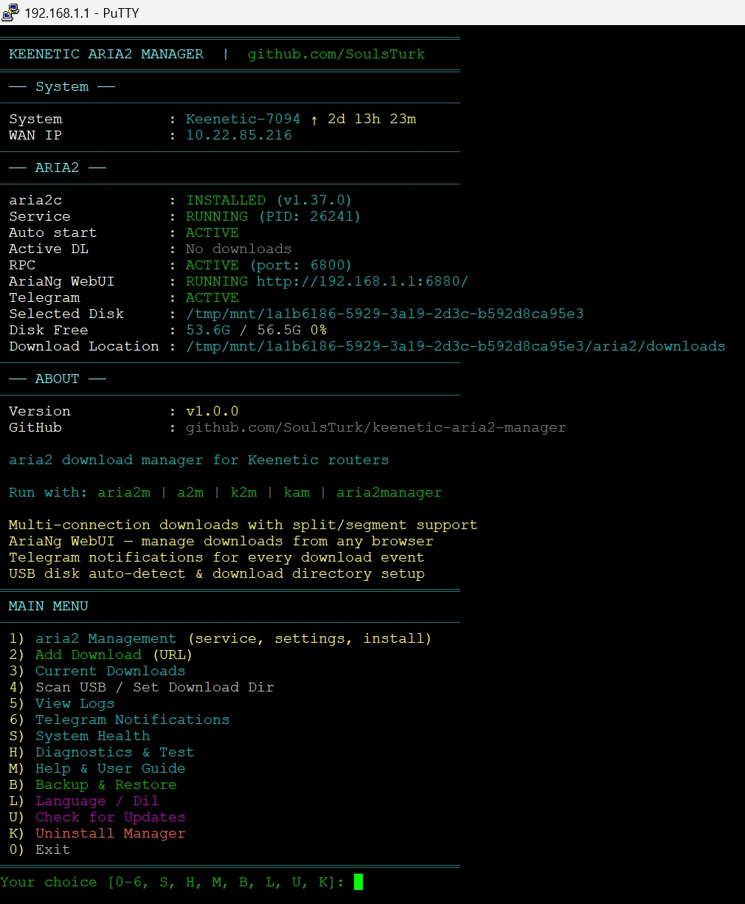

> Состояние системы, информация aria2, адрес AriaNg и все функции на одном экране.

---

### Меню 1 — Управление aria2
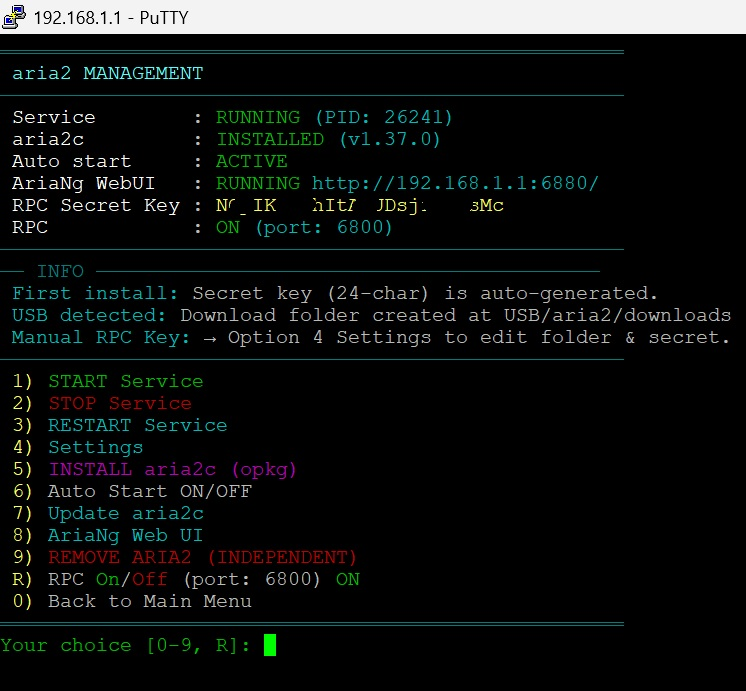

> Запуск/остановка сервиса, установка, обновление, веб-интерфейс AriaNg и управление RPC.

---

### Меню настроек (Опция 4)
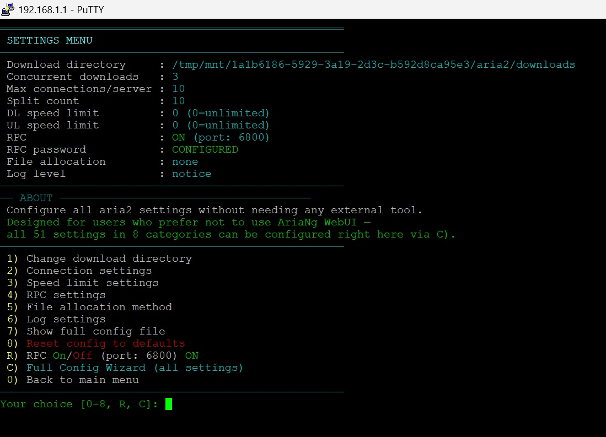

> Директория загрузок, настройки соединения, скорости, RPC, логов и **C) Полный мастер настроек** с 51 параметром.

---

### Веб-интерфейс AriaNg
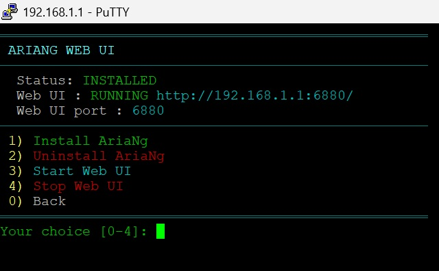

> Встроенный веб-интерфейс AriaNg — откройте `http://192.168.1.1:6880` в браузере.

---

### Уведомления Telegram
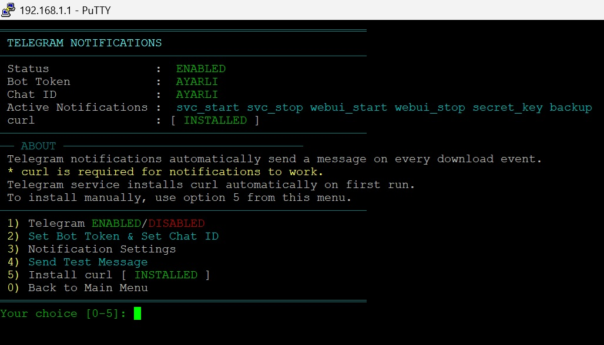

> Настройка Bot Token и Chat ID, установка curl и управление уведомлениями.

---

### Настройки уведомлений
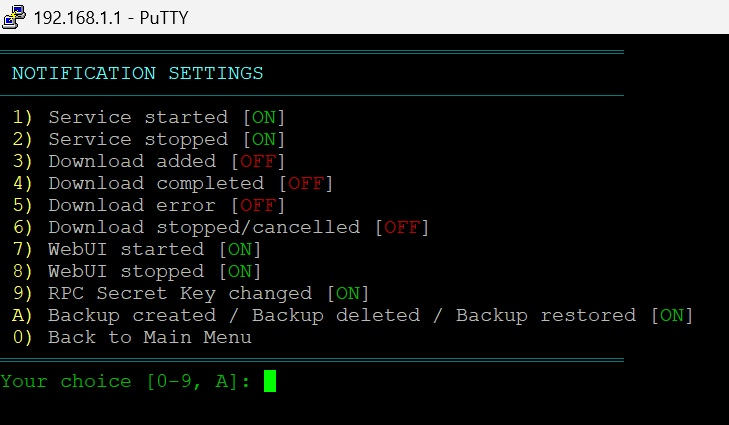

> Выберите, о каких событиях получать уведомления — сервис, загрузки, WebUI, резервные копии и другое.

---

### Резервное копирование
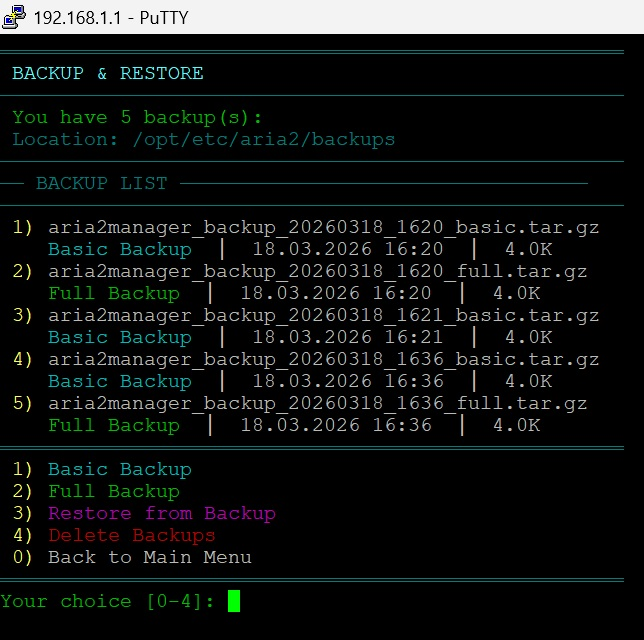

> Создание базовой и полной копии, список резервных копий, восстановление и удаление.

---

### Здоровье системы
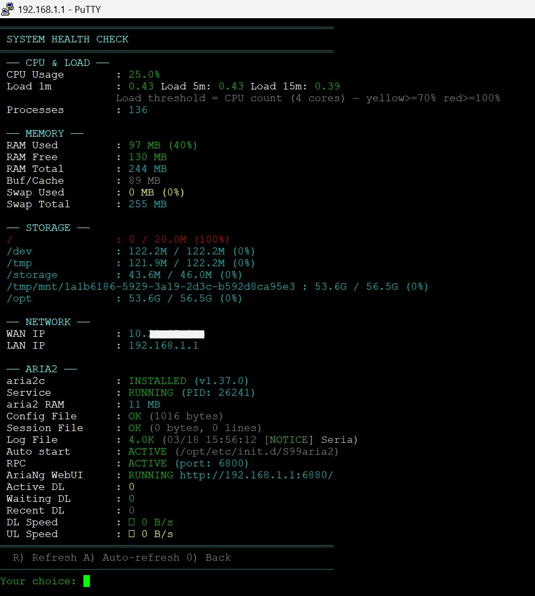

> CPU, RAM, хранилище, сеть, статус aria2 и скорость загрузки в реальном времени.

---

### Диагностика и тест
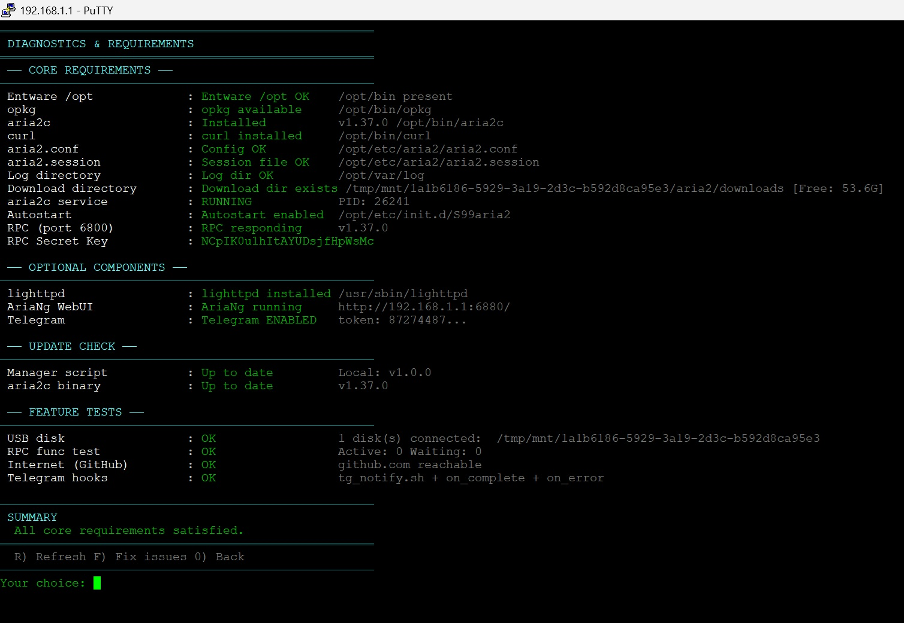

> Требования, опциональные компоненты, проверка обновлений и тесты функций.

---

### Обновление aria2
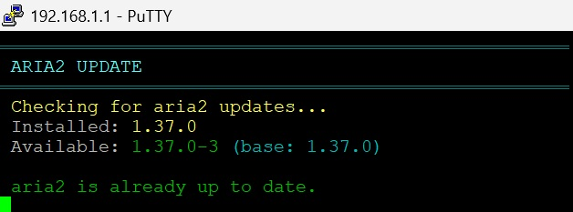

> Безопасное обновление бинарного файла aria2c через opkg.

---

### Полное удаление
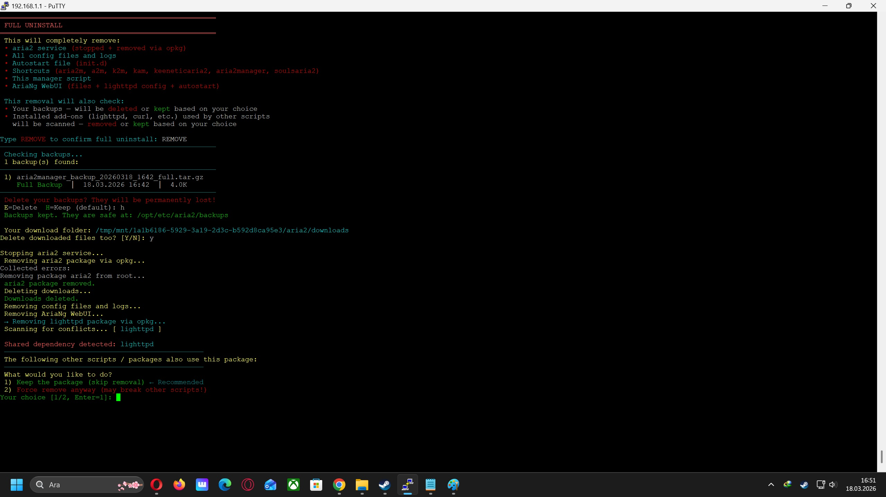

> Безопасное удаление с возможностью сохранить или удалить резервные копии.

---

### Выбор языка
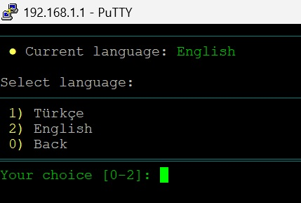

> Мгновенное переключение между турецким / английским языками.

---

### Справка и ЧАВО
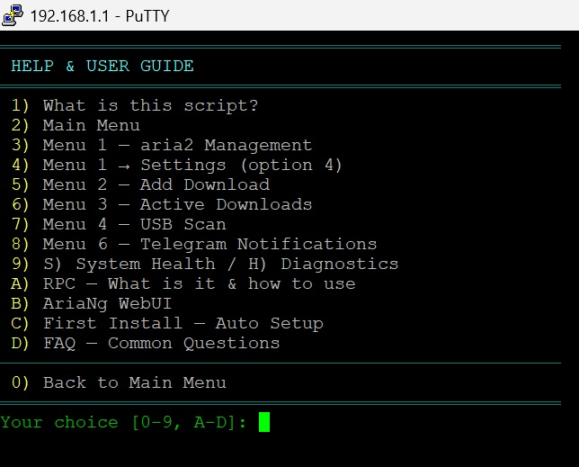

> Часто задаваемые вопросы, описания меню и руководство пользователя.

---

## 🗂️ Структура меню

```
Главное меню
├── 1) Управление aria2
│   ├── ЗАПУСК / ОСТАНОВКА / ПЕРЕЗАПУСК сервиса
│   ├── 4) Настройки
│   │   ├── Директория загрузок
│   │   ├── Настройки соединения
│   │   ├── Ограничения скорости
│   │   ├── Настройки RPC
│   │   ├── Метод выделения файлов
│   │   ├── Настройки логов
│   │   └── C) Полный мастер настроек (51 настройка, 8 категорий)
│   ├── 5) УСТАНОВИТЬ aria2c (opkg)
│   ├── 6) Автозапуск ВКЛ/ВЫКЛ
│   ├── 7) Обновить aria2c
│   └── 8) Веб-интерфейс AriaNg
├── 2) Добавить загрузку (URL)
├── 3) Текущие загрузки
├── 4) Сканировать USB / Задать директорию загрузок
├── 5) Просмотр логов
├── 6) Уведомления Telegram
│   ├── ВКЛЮЧЕНО/ВЫКЛЮЧЕНО
│   ├── Bot Token и Chat ID
│   ├── Настройки уведомлений (10 типов событий)
│   ├── Отправить тестовое сообщение
│   └── Установить curl
├── S) Здоровье системы
├── H) Диагностика и тест
├── M) Справка и руководство
├── B) Резервное копирование
│   ├── 1) Базовая резервная копия
│   ├── 2) Полная резервная копия
│   ├── 3) Восстановление из копии
│   └── 4) Удалить резервные копии
├── L) Language / Dil
├── U) Проверить обновления
└── K) Удалить менеджер
```

---

## 📱 Уведомления Telegram

Вы можете получать мгновенные уведомления Telegram о следующих событиях:

| Уведомление | Эмодзи | По умолчанию |
|---|---|---|
| Сервис aria2 запущен | ✅ | ВКЛ |
| Сервис aria2 остановлен | ⏹ | ВКЛ |
| Загрузка добавлена | ➕ | ВЫКЛ |
| Загрузка завершена | ✅ | ВЫКЛ |
| Ошибка загрузки | ❌ | ВЫКЛ |
| Загрузка остановлена | ⏸ | ВЫКЛ |
| WebUI запущен | 🖥️ | ВКЛ |
| WebUI остановлен | ⏹ | ВКЛ |
| Изменён секретный ключ RPC | 🔑 | ВКЛ |
| Резервная копия создана/удалена/восстановлена | 💾🗑♻️ | ВКЛ |

**Настройка:**
1. Создайте бота через [BotFather](https://t.me/botfather)
2. Скопируйте Bot Token
3. Узнайте свой Chat ID через [@userinfobot](https://t.me/userinfobot)
4. Меню 6 → 2) Задать Bot Token и Chat ID

---

## 💾 Система резервного копирования

### Базовая резервная копия
`aria2.conf`, `telegram.conf`, выбор языка

### Полная резервная копия
Базовая копия + файл сессии, init-скрипт, все hook-скрипты Telegram, настройка порта AriaNg

### Формат имён файлов
```
aria2manager_backup_YYYYMMDD_HHMM_basic.tar.gz
aria2manager_backup_YYYYMMDD_HHMM_full.tar.gz
```

Резервные копии сохраняются в `/opt/etc/aria2/backups/`.

> **Примечание:** Резервные копии не удаляются при удалении менеджера — вам будет задан вопрос.

---

## ❓ Часто задаваемые вопросы

**В: Могу ли я настроить параметры без установки aria2c?**
О: Да, Меню 1 → Настройки → C) Мастер настроек работает без установленного aria2c. Ваши настройки сохраняются после установки.

**В: Нужно ли скачивать что-то отдельно для AriaNg WebUI?**
О: Нет. Менеджер размещает AriaNg внутри. Меню 1 → 8) Веб-интерфейс AriaNg → Установить и Запустить — это всё, что нужно.

**В: Необходим ли curl для уведомлений Telegram?**
О: Да. Менеджер автоматически устанавливает curl при включении Telegram. Для ручной установки используйте Меню 6 → 5) Установить curl.

**В: Как обновить скрипт?**
О: Главное меню → U) Проверить обновления → подтвердить обновление.

**В: Хочу сбросить все настройки.**
О: Меню 1 → Настройки → 8) Сбросить конфигурацию. Или используйте B) Восстановление из резервной копии.

---

## 🧑‍💻 Участие в разработке

Pull request'ы и issues приветствуются.

```
github.com/SoulsTurk/keenetic-aria2-manager
```

---

## ⚠️ Отказ от ответственности

> [!WARNING]
> **Прочтите следующее перед использованием скрипта.**

Этот скрипт выполняет **настройки на уровне системы** на вашем роутере Keenetic:

- Запускает и останавливает фоновый сервис `aria2c`
- Создаёт и удаляет файлы конфигурации, hook- и init-скрипты в `/opt/etc/`
- **Открывает RPC API в сети** — порт по умолчанию `6800`, доступен со всех интерфейсов
- **Транслирует AriaNg WebUI в сети** — порт по умолчанию `6880`, доступен из локальной сети
- Управляет правилами `iptables` и веб-сервером lighttpd
- Читает и записывает файлы на USB-диске

### 🔐 Предупреждения о безопасности

| Риск | Описание | Меры предосторожности |
|---|---|---|
| **Открыт RPC-порт** | Порт 6800 доступен из LAN | Установите надёжный секретный ключ RPC |
| **Открыт порт WebUI** | Порт 6880 доступен из LAN | Не используйте в недоверенных сетях |
| **Секретный ключ** | Слабый или пустой ключ создаёт уязвимость | Скрипт автоматически генерирует 24-символьный ключ — не удаляйте его |
| **Токен Telegram** | Bot Token и Chat ID — конфиденциальные данные | Не передавайте их никому, защитите файл конфигурации |
| **Загружаемые файлы** | Скрипт не проверяет содержимое загружаемых URL | Загружайте только из доверенных источников |

### ⚖️ Условия использования

- Этот скрипт предоставляется **как есть (as-is)**, **без каких-либо гарантий**
- Неправильная конфигурация может привести к потере связи или проблемам с системой
- **Использование полностью на ваш страх и риск**
- Разработчик не несёт ответственности за любые прямые или косвенные убытки, возникшие в результате использования этого скрипта
- Рекомендуется **сделать резервную копию** перед внесением изменений в роутер (B) Резервное копирование)

---

## 📄 Лицензия

Лицензия GPL-3.0 — вы можете использовать и распространять, но при внесении изменений вы обязаны поделиться ими как открытым исходным кодом под той же лицензией.

---

## 🙏 Благодарности и источники вдохновения

При разработке этого проекта использовалось вдохновение от проекта [RevolutionTR](https://github.com/RevolutionTR) — **[keenetic-zapret-manager](https://github.com/RevolutionTR/keenetic-zapret-manager)**.

Общая архитектура скрипта, набор функций и структура меню были использованы в качестве основы при проектировании. Спасибо за усилия и вклад в открытое программное обеспечение. 🤝

---

<div align="center">

**Keenetic Aria2 Manager** · v1.0.1 · от [SoulsTurk](https://github.com/SoulsTurk)

</div>
